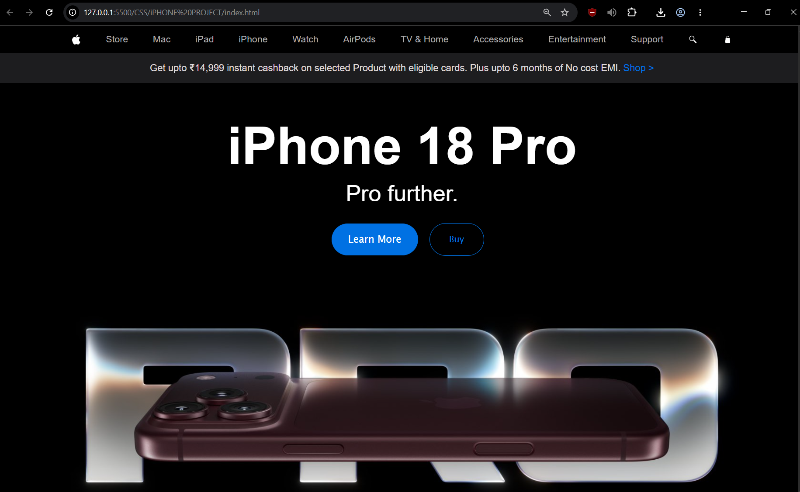

# iPhone 18 Pro Landing Page

A simple iPhone 18 Pro landing page recreated using HTML and CSS.

This project is mainly built for practice and learning. I wanted to improve my understanding of CSS by recreating a real-world style website instead of only following small CSS exercises.

## Preview

## What I Practiced

- Structuring a webpage using HTML
- CSS Flexbox
- Aligning and spacing elements
- Navigation bar layout
- Buttons and hover-ready styling
- Typography and font sizing
- Colors, borders and border-radius
- Working with images
- Building a layout from a visual reference

## Tech Used

- HTML5
- CSS3

## About This Project

This is not an official Apple website or an exact copy of the original website.

I built this project as part of my learning process to become more comfortable with CSS and frontend development. My goal was to take a familiar website design and try to recreate its layout myself instead of simply copying a tutorial.

The project is intentionally simple, but it helped me understand how different CSS properties work together to create a complete webpage.

## What I Learned

While building this project, I got more practice with Flexbox, spacing, sizing, positioning, typography and organizing different sections of a webpage.

I am still learning CSS, so this project is one of the steps in improving my frontend fundamentals.

## Disclaimer

Apple, iPhone and related trademarks belong to Apple Inc.

This project is created only for educational and learning purposes.

## Author

**Tushar Singh**

Learning frontend development and building projects along the way.
